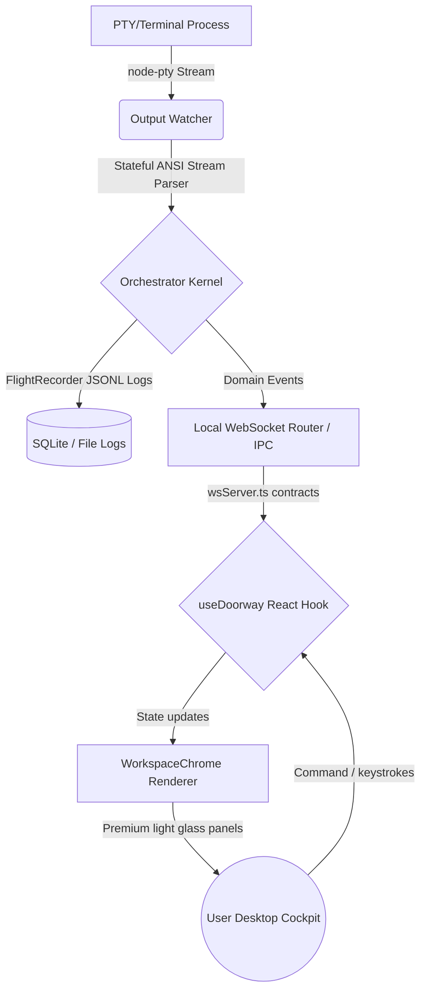

# Doorway Fresh Start Master Context + Execution Prompt

**Product:** Doorway  
**Document type:** Fresh-start master context, product definition, architecture reset, and coding-agent handoff prompt  
**Purpose:** Give any new AI coding agent a clean, complete understanding of Doorway from first principles so the existing codebase can be repaired feature-by-feature without fake UI, dead code, broken backend paths, or confused architecture.  
**Rule:** This document replaces scattered thinking. Use it as the single starting point before touching code.

---

## 0. Why This Document Exists

Doorway became too complex too fast.

We now have many PRDs, many ideas, many generated files, and a codebase that may contain:

- broken frontend state
- black-screen app behavior
- fake/demo UI
- dummy projects/chats/tests
- dead code
- disconnected backend packages
- multiple incomplete architectural directions
- terminal code that may spawn badly or lose session identity
- orchestration logic that is not yet real
- backend claims that are not proven by runtime behavior
- frontend that does not yet reflect the real product

The solution is not another random feature.

The solution is:

> **Restart from a clean master context, keep the existing codebase, audit it brutally, then rebuild Doorway one real vertical slice at a time.**

This document tells every agent:

1. What Doorway is.
2. Why Doorway exists.
3. What the main feature is.
4. What the tech stack is.
5. What must never be faked.
6. What to build first.
7. How to clean the existing codebase.
8. How the terminal harness and orchestration must work.
9. How the frontend must present this beautifully.
10. How to proceed feature-by-feature without drifting.

---

## 1. Doorway in One Sentence

> **Doorway is a local-first adaptive AI IDE that runs real CLI coding tools in managed terminals, learns useful workflows, turns repeated work into automations, and presents everything through a beautiful chat-first workspace.**

Shorter:

> **Doorway gets better every time you build.**

Even more practical:

> **Doorway is the IDE cockpit where Claude Code, Codex CLI, Cursor CLI, OpenCode, Gemini CLI, Aider, Pi-like agents, browser tools, connectors, plugins, and automations become visible, controllable workers.**

---

## 2. What Doorway Is Not

Doorway is not:

```text
just a Claude Code GUI
just a Codex clone
just a Cursor clone
just a Conductor clone
just a terminal skin
just a fake AI dashboard
just a chat app
just a webview around CLI tools
just a pretty frontend with fake agent cards
```

Doorway is also not trying to bypass provider systems or secretly use private internals.

The visible worker lane uses:

```text
real user-installed CLI tools
real PTY terminals
real local files
real workspaces/worktrees
real outputs
real user approval
```

Doorway’s value is the workspace, harness, routing, workflow learning, terminal management, automations, connectors, evidence, and frontend experience.

---

## 3. Why Doorway Exists

The AI coding market is moving toward many specialized tools:

```text
Claude Code
Codex CLI / Codex Desktop
Cursor
OpenCode
Gemini CLI
Aider
Devin CLI-style tools
Pi-style agents
T3 Code-style multi-provider tools
Conductor-style workspace orchestration
cmux-style terminal multiplexing
```

Each tool is powerful, but the user experience becomes messy:

```text
many terminals
many agents
many contexts
many prompts
many branches
many logs
many browser checks
many PRs
many review styles
no shared workflow memory
no clean orchestration layer
```

Doorway exists to solve this:

```text
One workspace.
Many tools.
Managed terminals.
Clear agent lanes.
Adaptive workflows.
Clean frontend.
Real output.
No fake state.
```

---

## 4. The Main Feature

Doorway’s main feature is not only frontend and not only worktrees.

The main feature is:

> **The adaptive terminal harness + orchestration layer.**

That means:

```text
Doorway can run real CLI tools,
know which tool is doing what,
remember which terminal belongs to which task,
continue the correct session,
detect when attention is needed,
summarize progress into the UI,
learn repeated workflows,
and turn those workflows into automations.
```

The three core pillars:

```text
1. Visible Harness
2. Adaptive Orchestration
3. Workflow Memory + Automations
```

Supporting pillars:

```text
4. Workspaces / worktrees
5. Plugins / skills / connectors
6. Peer-to-peer agent collaboration
7. Browser proof
8. Beautiful frontend cockpit
9. Self-adaptive harness improvements
```

---

## 5. Product Pillars

### Pillar 1 — Visible Harness

Doorway runs real tools inside managed terminal lanes.

Examples:

```text
Claude Code
Codex CLI
Cursor CLI
OpenCode
Gemini CLI
Aider
Pi-like agents
Devin CLI-style tools
custom company CLIs
non-coding CLIs
```

The user can see:

```text
which terminal is running
which CLI tool owns it
which project/worktree it uses
what prompt started it
what it is doing now
whether it needs input
whether it needs permission
whether it is stuck
whether it finished
```

Doorway must avoid the current common failure:

```text
every prompt creates another messy OS terminal
nobody knows which terminal belongs to which task
outputs cannot be summarized
follow-ups go to the wrong place
long-running tasks become invisible
```

Doorway solves this with an internal terminal multiplexer.

---

### Pillar 2 — Adaptive Orchestration

Doorway understands work as:

```text
thread
goal
tool lane
terminal session
worktree
connector session
browser proof
automation
evidence
```

It can decide:

```text
continue existing terminal
start a new terminal
fork a worktree
handoff to another tool
compact context
ask user
pause
resume
run proof
suggest automation
```

This is the coordinator brain of Doorway.

---

### Pillar 3 — Workflow Memory + Automations

Doorway should learn useful patterns.

Not random chat history.

Useful workflow memory means:

```text
For this repo, UI changes usually use Claude Code.
After UI changes, user runs pnpm typecheck.
After frontend changes, user opens localhost:3000.
After implementation, Codex reviews the diff.
For Linear issues, user likes GitHub PR output.
For Figma tasks, user wants before/after browser proof.
```

Doorway turns repeated patterns into automation suggestions:

```text
“You used Claude Code → typecheck → browser proof → Codex review three times.
Save this as UI Change Review?”
```

This is one of the biggest product breakthroughs.

---

## 6. Inspiration Sources and What Doorway Learns From Each

Do not copy these products. Learn from them.

### 6.1 Pi Agent

Doorway learns:

```text
self-adapting agent behavior
agent harness mindset
agents that can improve their own workflow
peer-like collaboration
minimal but powerful terminal usage
```

Doorway adaptation:

```text
self-adaptive harness lab
workflow memory
automation suggestions
peer agent mailbox
safe self-worktree for improving Doorway itself
```

#### Technical Protocol & Implementation Architecture (from `pi-mono`):
1. **Lazy LLM Provider Registry**: Providers in `packages/ai` are registered via lazy loader wrappers (`register-builtins.ts`) that are only imported and instantiated when active stream queries occur. This avoids static memory bloat on app start.
2. **Environment & Credential Auto-Checks**: Active login states are dynamically verified using local shell credential detectors (`env-api-keys.ts`).
3. **Self-Improvement Safety Boundary**: Standardizing git worktrees (`auto-worktree` strategy) blocks local execution paths from modifying the active workspace files. Self-updates are isolated in subpath branch-spaces and require structured verification and approval.

---

### 6.2 cmux

Doorway learns:

```text
AI agent terminal workflows need terminal multiplexing.
Users cannot manage 100 external terminal windows.
Terminals need notifications, tabs, splits, browser pairing, workspace metadata, and attention states.
```

Doorway adaptation:

```text
internal TerminalMux
vertical terminal sessions
agent lane list
attention rings
terminal drawer
browser split/drawer
session metadata
scriptable internal terminal actions
```

#### Technical Protocol & Process Multiplexing (from `cmux`):
1. **Stateful Stream Parsing**: Process outputs spawned via `node-pty` are captured by an output watcher that parses raw ANSI escape sequences into clean plain text streams in real-time.
2. **Stuck / Loop Detection Indicators**: Implements PTY quiet thresholds (monitoring output inactivity and repetition) to trigger active workspace notifications.
3. **Interactive Terminals**: Integrates interactive stdin routing where manual keyboard keystrokes and permission decisions are written directly to active PTY channels via local IPC.

---

### 6.3 Cursor

Doorway learns:

```text
premium frontend taste
chat/composer as command surface
codebase context
model/tool selection
inline context experience
clean message layout
```

Doorway adaptation:

```text
beautiful light UI
thin rail + sidebar + thread canvas
message capsules
@tool mentions
slash commands
composer controls
premium typography
no fake dashboard
```

#### Visual UX Components (from Cursor 3):
1. **Composer Context Tray**: A visually clean tray displaying pinned files, targeted workspace folders, and live token budgets.
2. **ReviewCritic Severity Drawer**: A slide-out panel classifying static analysis errors, test breaks, and lint failures by severity (error, warning, suggestion) with direct file/line/evidence links.
3. **WorktreeGraph Nodes**: Visual git branch graphs mapping isolated agent directories directly inside the merge review panel.

---

### 6.4 Codex CLI / Codex Desktop

Doorway learns:

```text
task/session discipline
tool/plugin mindset
connectors
automation potential
review/report flows
browser/computer-use proof
structured state and logs
```

Doorway adaptation:

```text
plugins
skills
connectors
automation runtime
run reports
browser proof
evidence refs
tool lanes
```

#### Flight Recorder & Session Protocol (from Codex):
1. **FlightRecorder logs**: Session states are persisted as sequential JSONL arrays containing chronological API inputs, system outputs, shell commands, and screenshots.
2. **Session Picker Overlays**: Users can seamlessly rewind, branch, or restore active cockpit sessions at any event boundary using the flight recorder logs.
3. **SQ/EQ Protocol Event Inspector**: Renders process events directly showing the visual correlation between agent prompts and PTY responses.

---

### 6.5 Conductor

Doorway learns:

```text
agent/workspace organization
branches/worktrees
ready/review states
multi-agent work visibility
```

Doorway adaptation:

```text
worktree graph
agent lanes
reviewable state
completion report
safe integration branch
```

#### Multi-Worktree Orchestration:
1. **Repo Rules Editor (`DOORWAY.md`)**: Visual markdown interface to view, edit, and enforce custom workspace execution policies directly consumed by the agent coordinator.
2. **Integration Merge Badges**: Clean visual pills depicting worktree readiness (ready, risky, blocked) based on test and diff analysis.

---

### 6.6 T3 Code / OpenCode / Multi-provider tools

Doorway learns:

```text
users want provider choice
OSS models matter
BYOK matters
premium orchestration matters more than model ownership
```

Doorway adaptation:

```text
BYOK provider settings
OSS model support
custom endpoints
plugin marketplace
workflow packs
provider-independent orchestration
```

#### WebSocket Client-Server RPC Schemas (from `t3code`):
1. **Type-Safe Contract Schemas**: WebSocket payloads are structured using rigid interface contracts that guarantee server-to-client updates on channel `orchestration.domainEvent` match expected UI formats.
2. **Client-Side Event Projections**: High-level visual lanes (e.g. status transitions, changed file counts, additions/deletions) are generated dynamically by processing raw stream streams rather than using hardcoded values.

---

## 6.7 Cockpit Architecture & Data Flow Diagram



---

## 7. Tech Stack

### 7.1 Current main stack

Use:

```text
Electron
React
TypeScript
Tailwind
Radix/shadcn-style primitives
Monaco editor
xterm.js
node-pty
SQLite
Playwright for browser proof
```

### 7.2 Future native stack

Rust can come later for:

```text
doorwayd
native PTY/process supervisor
file watcher
sandbox layer
git/worktree engine
crash recovery
native automation
```

Do not add Rust first just to feel advanced.

The immediate job:

```text
make the TypeScript/Electron app real, clean, and gate-passing
```

---

## 8. Architecture Overview

```text
Frontend
  AppShell
  UtilityRail
  MainSidebar
  ThreadCanvas
  Composer
  AgentCapsules
  TerminalDrawer
  BrowserDrawer
  AutomationDrawer
  ConnectorDrawer

Protocol
  ThreadProjection
  ComposerProjection
  ToolLaneProjection
  TerminalProjection
  WorktreeProjection
  AutomationProjection
  ConnectorProjection
  EvidenceProjection

Backend Services
  OrchestratorKernel
  TerminalMux
  AgentLaneManager
  WorktreeManager
  OutputWatcher
  CompletionConfidenceEngine
  WorkflowMemoryService
  AutomationSuggestionService
  ConnectorRegistry
  PluginRegistry
  EvidenceLedger

Runtime
  node-pty
  process supervisor
  output parser
  terminal input router
  browser proof runner

Persistence
  SQLite state
  terminal logs
  evidence refs
  workflow memory
  automation definitions
```

---

## 9. The Core Runtime Objects

### 9.1 Thread

A user-visible conversation/workflow.

```ts
type Thread = {
  id: string;
  projectId: string;
  title: string;
  status: "active" | "running" | "waiting" | "completed" | "archived";
};
```

### 9.2 Goal

A long-running objective inside a thread.

```ts
type GoalSession = {
  id: string;
  threadId: string;
  goalText: string;
  status:
    | "planning"
    | "running"
    | "waiting_for_input"
    | "needs_approval"
    | "stuck"
    | "reviewable"
    | "completed"
    | "failed";
  activeLaneIds: string[];
};
```

### 9.3 Tool Lane

One tool doing one role.

```ts
type ToolLane = {
  id: string;
  threadId: string;
  goalId?: string;
  toolId: string;
  role: "implementer" | "reviewer" | "browser" | "tester" | "connector" | "automation" | "custom";
  terminalSessionId?: string;
  connectorSessionId?: string;
  worktreeId?: string;
  status: ToolLaneStatus;
  latestActivity: string;
};
```

### 9.4 Terminal Session

A real PTY session.

```ts
type TerminalSession = {
  id: string;
  laneId: string;
  toolId: string;
  cwd: string;
  command: string;
  args: string[];
  status: "starting" | "running" | "waiting" | "exited" | "failed" | "killed";
  startedAt: string;
  exitedAt?: string;
  exitCode?: number;
};
```

### 9.5 Worktree

Safe filesystem branch/workspace.

```ts
type WorktreeRecord = {
  id: string;
  projectId: string;
  threadId: string;
  laneId?: string;
  path: string;
  branchName: string;
  baseCommit: string;
  status: "creating" | "clean" | "dirty" | "running" | "reviewable" | "conflict" | "merged" | "archived";
};
```

### 9.6 EvidenceRef

Proof for a user-visible claim.

```ts
type EvidenceRef = {
  id: string;
  kind:
    | "terminal_chunk"
    | "terminal_input"
    | "diff"
    | "test_result"
    | "browser_screenshot"
    | "connector_context"
    | "automation_pattern"
    | "permission_receipt"
    | "peer_message";
  targetId: string;
  label: string;
};
```

---

## 10. Current Codebase Reset Strategy

The existing codebase should not be thrown away blindly.

But it must be audited and cleaned.

### 10.1 First job: make truth visible

Before building any big feature, run a reality audit:

```text
What app boots?
What is black-screening?
Which packages are used?
Which files are dead?
Which UI state is fake?
Which backend paths are duplicated?
Which tests fail?
Which build scripts hide failures?
Which services are interfaces only?
```

### 10.2 Delete or quarantine fake code

Move fake/demo components to:

```text
stories/
__fixtures__/
dev-only/
```

Production app cannot import them.

### 10.3 Root gate must be honest

No:

```text
|| true
fake passing tests
ignored typecheck
silent lint failure
```

The first rebuild target:

```text
app boots
frontend shell visible
no fake data
root gate honest
```

---

## 11. Build Approach: One Feature at a Time

No timelines. No “V1/V2” language.

Use feature-clearing.

Each feature must have:

```text
problem
real data source
backend owner
frontend projection
UI state
tests
acceptance criteria
```

Feature cannot be considered done if it only exists in UI.

---

## 12. Feature Clearing Order

### Feature 0 — Reality Reset

Goal:

```text
Make the app boot and remove fake production claims.
```

Tasks:
- fix black screen
- remove fake UI state
- remove `|| true`
- identify canonical preload/main paths
- ensure package scripts are honest
- create real empty states
- document current broken areas

Acceptance:
```text
Doorway opens to a clean shell with honest empty states.
```

---

### Feature 1 — Frontend Shell

Goal:

```text
Build the beautiful Doorway shell.
```

Layout:

```text
thin utility rail
→ translucent separator
→ main sidebar
→ thread canvas
→ composer
```

Components:
- UtilityRail
- MainSidebar
- ThreadCanvas
- MessageCapsules
- ComposerDock
- AgentCapsule placeholder with real empty state

Acceptance:
```text
Frontend looks like Doorway, not a dashboard.
No fake project/chat/test/terminal data.
```

---

### Feature 2 — Protocol Projections

Goal:

```text
UI consumes typed projections instead of inventing state.
```

Add:
- ThreadProjection
- ComposerProjection
- ToolLaneProjection
- TerminalProjection
- WorktreeProjection
- AutomationProjection
- ConnectorProjection
- EvidenceProjection

Acceptance:
```text
Frontend renders from projections only.
```

---

### Feature 3 — TerminalMux

Goal:

```text
Doorway can run terminals inside the app without OS-window chaos.
```

Build:
- node-pty runtime
- xterm.js renderer
- session registry
- terminal drawer
- terminal tabs/list
- output persistence
- input routing
- interrupt/kill

Acceptance:
```text
User can open terminal in Doorway, run a command, see output, and session is tracked.
```

---

### Feature 4 — Tool Profiles

Goal:

```text
Doorway knows how to launch tools.
```

Profiles:
- Claude Code
- Codex CLI
- custom CLI

Each profile defines:
- command
- args
- cwd rules
- auth mode
- supports compact?
- supports resume?
- known prompt patterns

Acceptance:
```text
Tool profile creates launch spec.
Adapter does not raw-spawn.
TerminalMux owns execution.
```

---

### Feature 5 — Tool Lanes

Goal:

```text
Every tool run has identity.
```

Add:
- ToolLaneService
- AgentCapsuleProjection
- lane status
- latest activity
- terminal link

Acceptance:
```text
Running Claude Code appears as a real lane in UI with terminal session identity.
```

---

### Feature 6 — @Mentions and Slash Commands

Goal:

```text
Composer becomes the control surface.
```

Mentions:
```text
@CloudCode
@Codex
@Cursor
@Browser
@GitHub
@Linear
@Figma
@Reviewer
```

Slash commands:
```text
/goal
/plan
/build
/debug
/review
/automate
/connect
/proof
/compact
/handoff
/check
/pr
```

Acceptance:
```text
Mention resolves to configured tool or setup-required state.
Slash command produces structured intent.
```

---

### Feature 7 — Orchestrator Routing

Goal:

```text
Doorway decides whether to continue, launch, fork, handoff, compact, or ask.
```

Decision options:
- reuse lane
- new lane
- fork lane
- handoff
- compact then continue
- ask user

Acceptance:
```text
Follow-up to active Claude task reuses correct Claude lane instead of opening random new terminal.
```

---

### Feature 8 — Worktree Layer

Goal:

```text
Agent work is isolated.
```

Build:
- WorktreeManager
- branch naming
- base commit
- lane-to-worktree mapping
- non-git terminal-only mode

Acceptance:
```text
Claude and Codex can run in separate worktrees from same thread.
```

---

### Feature 9 — Output Watcher

Goal:

```text
Doorway understands terminal attention states.
```

Detect:
- permission prompt
- question prompt
- auth/setup prompt
- command output
- test result
- error
- URL/port
- likely done
- stuck/quiet

Acceptance:
```text
When terminal asks a question, UI shows waiting_for_input.
When terminal exits, UI updates status.
```

---

### Feature 10 — Completion Confidence

Goal:

```text
Doorway does not guess blindly when a terminal is done.
```

Use signals:
- process exit
- prompt returned
- final summary pattern
- no child process
- test finished
- git diff stable
- question detected
- permission prompt
- loop/stuck

Acceptance:
```text
UI can show running/waiting/probably done/reviewable/failed based on evidence.
```

---

### Feature 11 — Doorway-Level /compact

Goal:

```text
Doorway can summarize and checkpoint long terminal sessions.
```

Checkpoint includes:
- original goal
- current status
- files changed
- commands run
- tests
- errors
- last important terminal lines
- next action

Acceptance:
```text
/compact creates a checkpoint and can feed it back as follow-up.
```

---

### Feature 12 — Workflow Memory

Goal:

```text
Doorway learns useful repeated patterns.
```

Learn:
- preferred tools
- repeated commands
- project test commands
- browser proof URL
- review flow
- connector usage

Acceptance:
```text
After repeated patterns, Doorway can suggest an automation.
```

---

### Feature 13 — Automation Suggestions

Goal:

```text
Repeated workflows become reusable.
```

UI:
```text
Doorway noticed a repeated workflow.
Save as automation?
```

Acceptance:
```text
User can save/edit/run automation.
No automation runs destructive steps silently.
```

---

### Feature 14 — Connectors

Goal:

```text
Doorway bridges external context to terminal power.
```

Start with:
- GitHub
- Linear
- Figma

Acceptance:
```text
User can reference a connector in composer and Doorway creates context for a tool lane.
```

---

### Feature 15 — Browser Proof

Goal:

```text
Doorway can verify UI changes visually.
```

Build:
- browser drawer
- local URL
- screenshot
- action trace later
- before/after later

Acceptance:
```text
Browser proof creates EvidenceRef linked to thread.
```

---

### Feature 16 — Peer Agent Collaboration

Goal:

```text
Agents can ask each other questions through Doorway.
```

Build:
- AgentRegistry
- MailboxService
- send/pull/wait
- peer message card
- loop guard

Acceptance:
```text
Claude lane can ask Codex lane to verify something and UI shows the exchange.
```

---

### Feature 17 — Self-Adaptive Harness Lab

Goal:

```text
Doorway can safely improve its own harness behavior.
```

Flow:
```text
proposal
→ self-worktree
→ patch
→ tests
→ review
→ approval
→ apply
```

Acceptance:
```text
Doorway can propose a parser improvement without silently modifying itself.
```

---

## 13. Frontend North Star

The frontend must be the simplest way to understand the power.

### 13.1 Main screen

```text
thin rail
sidebar
thread canvas
message capsules
agent capsule
composer
```

### 13.2 Message rules

- user messages right
- Doorway messages left
- every message in capsule
- no profile photo on every message
- agent activity inside nested capsule
- no raw logs in chat unless user opens terminal

### 13.3 Composer rules

Visible controls:

```text
+
/
Ask first / Full control
Primary tool selector
Auto / Careful / Parallel
Send
```

Text supports:

```text
@CloudCode
@Codex
@Linear
@Figma
/goal
/automate
/compact
```

### 13.4 UI states

Every screen must have:
- loading
- empty
- ready
- error
- unconfigured

Never fill with fake content.

---

## 14. Backend North Star

The backend must make the frontend real.

For every UI claim, backend provides evidence.

Examples:

```text
“Claude running” -> ToolLane + TerminalSession
“3 files changed” -> Worktree diff
“Needs approval” -> OutputWatcher prompt
“Reviewable” -> CompletionConfidence + diff/test evidence
“Automation suggested” -> repeated WorkflowMemory pattern
```

---

## 15. Quality Rules

Agents must obey the rules pack:

```text
AGENTS.md
rules.md
rules/no-slop-quality-gate.rules.md
rules/frontend.rules.md
rules/harness-orchestrator.rules.md
rules/backend-infrastructure.rules.md
rules/adaptive-automation.rules.md
```

If the repo does not contain these files, add them.

Core bans:

```text
no fake production UI
no dead code
no architecture theater
no hidden failures
no raw-spawn adapters
no direct UI invented state
no fake terminal output
no fake tests
```

---

## 16. Fresh Chat Prompt for Any AI Coding Agent

Use this when opening a new chat with a coding agent.

```text
You are working on Doorway.

Doorway is a local-first adaptive AI IDE. It runs real CLI tools like Claude Code, Codex CLI, Cursor CLI, OpenCode, Gemini CLI, Aider, Pi-like agents, and custom CLIs inside managed terminal sessions. It learns useful workflow patterns, turns repeated work into automations, and presents everything through a premium chat-first frontend.

Doorway is not a Claude wrapper, Codex clone, Cursor clone, or fake dashboard.

The current codebase is messy and may contain broken frontend state, black-screen issues, fake UI, dummy projects/chats/tests, dead code, disconnected backend packages, duplicated main/preload paths, and incomplete architecture. Your job is to repair it from first principles without pivoting.

The main product feature is:
Visible CLI Harness + Adaptive Orchestration + Workflow Memory + Automations.

Important architecture:
- Frontend: Electron + React + TypeScript + Tailwind/Radix + Monaco + xterm.js.
- Runtime: node-pty for internal terminal mux.
- Persistence: SQLite.
- Browser proof: Playwright later.
- Rust/native core is future only, not required now.

Core concepts:
- Thread: user-visible conversation/workflow.
- GoalSession: long-running objective.
- ToolLane: one tool doing one role.
- TerminalSession: real PTY session.
- WorktreeRecord: safe workspace/branch for agent work.
- EvidenceRef: proof for user-visible claims.
- WorkflowMemory: useful repeated patterns.
- Automation: saved repeatable workflow.

Non-negotiable rules:
- No fake production data.
- No fake projects, fake chats, fake tests, fake terminal output, fake diffs, fake agent status.
- No dead code.
- No hidden failures.
- No `|| true`.
- No direct raw-spawn inside adapters.
- TerminalMux owns PTY execution.
- UI renders backend projections only.
- Every user-facing claim needs evidence or honest unknown state.
- No hidden SDK/programmatic mode for visible CLI workers.
- Run real user-installed CLI tools in visible PTYs.

Current rebuild order:
1. Reality Reset: app boots, no fake state, root gates honest.
2. Frontend Shell: thin rail, sidebar, thread canvas, composer, message capsules.
3. Protocol Projections: typed data contracts for UI.
4. TerminalMux: internal terminal sessions using node-pty + xterm.js.
5. Tool Profiles: Claude Code, Codex CLI, custom CLI.
6. Tool Lanes: map tool + terminal + thread + worktree.
7. Mentions and slash commands: @CloudCode, @Codex, /goal, /compact, /automate.
8. Orchestrator Routing: continue/new lane/fork/handoff/compact.
9. Worktree Layer: per-lane isolation.
10. Output Watcher: detect prompts, questions, errors, tests, status.
11. Completion Confidence: running/waiting/probably done/reviewable/failed.
12. Doorway-level /compact.
13. Workflow Memory.
14. Automation Suggestions.
15. Connectors.
16. Browser Proof.
17. Peer Agent Collaboration.
18. Self-Adaptive Harness Lab.

Before coding:
- inspect the repo
- identify actual root
- run available gates
- find fake/demo state
- find dead files
- identify canonical app entrypoints
- report current reality honestly

When implementing:
- build one real vertical slice at a time
- write tests
- wire backend projection to frontend
- remove obsolete code
- never add fake success states

Final response format:
Changed:
- ...

Verified:
- ...

Remaining risks:
- ...

Files:
- ...
```

---

## 17. First Task Prompt: Reality Reset

Use this as the first actual coding task.

```text
Perform Doorway Reality Reset.

Goal:
Make the existing Doorway codebase honest, bootable, and ready for real feature rebuilding.

Do not add new product features yet.

Tasks:
1. Identify repo root and package manager.
2. Run current gates: typecheck, lint, test, build if available.
3. Report all failures honestly.
4. Find fake production UI state:
   - fake projects
   - fake chats
   - fake test output
   - fake terminal output
   - fake agent status
   - hardcoded success
5. Find dead/unused files and duplicate entrypoints.
6. Identify canonical Electron main, preload, renderer entry.
7. Remove `|| true` or hidden failure scripts.
8. Replace fake production UI with honest empty/loading/error states.
9. Ensure app boots to Doorway shell if possible.
10. Create or update AGENTS.md/rules files if missing.
11. Do not build terminal harness yet unless needed to boot.
12. Produce a report: current state, fixed items, remaining blockers.

Definition of done:
- app no longer black-screens if fixable in scope
- production UI has no fake data
- gate scripts are honest
- current failures are known and documented
- next feature can start cleanly
```

---

## 18. Second Task Prompt: Frontend Shell

Use only after Reality Reset.

```text
Build Doorway Frontend Shell.

Goal:
Create the real Doorway visual foundation without fake production data.

Layout:
- thin utility rail
- translucent separator
- main sidebar
- thread canvas
- message capsules
- composer dock

Rules:
- light-first premium design
- no permanent right inspector
- no emoji icons
- no fake project/chat/test/terminal data
- honest empty states only
- message capsules: user right, Doorway left
- composer supports visual placeholders for +, /, permission mode, tool selector, behavior selector, send

Backend:
- use projection types even if backed by empty state
- no hardcoded fake success data

Definition of done:
- app shows clean Doorway shell
- no fake production state
- build/typecheck/lint status reported
```

---

## 19. Third Task Prompt: TerminalMux Vertical Slice

Use only after frontend shell is stable.

```text
Build Doorway TerminalMux vertical slice.

Goal:
Run one real terminal session inside Doorway and track it as a TerminalSession.

Requirements:
- node-pty starts shell
- xterm.js renders output
- TerminalSession record created
- terminal input works
- terminal output stored as raw/clean chunks
- interrupt/stop available
- UI terminal drawer opens from rail
- no OS-window explosion
- no tool adapter raw-spawn

Definition of done:
- user can open terminal, run `pwd` or equivalent, see real output
- session has id/status/cwd/start time
- output is persisted or at least captured in runtime state
- no fake terminal state
```

---

## 20. Fourth Task Prompt: Claude/Codex Tool Lane

Use only after TerminalMux works.

```text
Build first ToolLane integration.

Goal:
Launch a configured CLI tool through TerminalMux and represent it as a ToolLane.

Start with:
- Claude Code profile if installed
- Codex CLI profile if installed
- fallback custom command profile

Rules:
- adapter builds launch spec only
- TerminalMux starts PTY
- ToolLane maps thread + tool + terminal + cwd
- UI agent capsule shows real lane status
- if tool missing, show setup-required state

Definition of done:
- clicking/selecting tool creates real ToolLane
- terminal opens inside Doorway
- lane status updates from terminal session
- no fake agent status
```

---

## 21. Fifth Task Prompt: Orchestrator Routing

Use only after ToolLane exists.

```text
Build first Orchestrator Routing.

Goal:
Composer can route @CloudCode or @Codex to the correct ToolLane.

Implement:
- parse @mentions
- parse simple slash command
- choose reuse existing lane or create new lane
- persist routing decision
- send prompt to terminal input
- show user prompt and Doorway response in thread

Definition of done:
- @CloudCode prompt launches/reuses Claude lane
- follow-up in same thread reuses correct lane when appropriate
- routing decision is visible/debuggable
- no random new terminal per prompt
```

---

## 22. Product Language To Use

Use:

```text
adaptive IDE
visible harness
tool lanes
workflow memory
automation suggestions
terminal cockpit
agent capsule
browser proof
connector-to-terminal bridge
self-adaptive harness
```

Avoid leading with:

```text
governance
enterprise control plane
compliance
policy engine
```

Those concepts can exist later, but they should not define the product vibe.

---

## 23. Final North Star

Doorway should feel like:

```text
I open my project.
I type what I want.
I can tag tools like @CloudCode and @Codex.
Doorway runs them in clean managed terminals.
Doorway remembers which terminal belongs to which task.
Doorway summarizes progress in beautiful chat capsules.
Doorway learns my repeated workflows.
Doorway suggests automations.
Doorway connects issues, designs, browsers, and terminals.
Doorway helps non-technical users use powerful coding tools.
Doorway helps technical users inspect every command, file, and diff.
```

That is the product.

---

## 24. Final Brutal Rule

If Doorway has pretty UI but fake backend, it fails.

If Doorway runs terminals but cannot remember sessions, it fails.

If Doorway creates new terminal chaos for every prompt, it fails.

If Doorway cannot continue the correct tool session, it fails.

If Doorway cannot learn repeated workflows, it loses the breakthrough.

If Doorway builds this cleanly, it becomes:

> **The adaptive AI IDE that turns real terminal-based AI work into reusable, visible, automatable workflows.**
